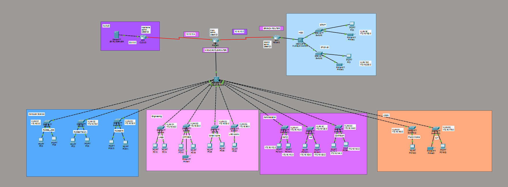
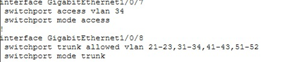
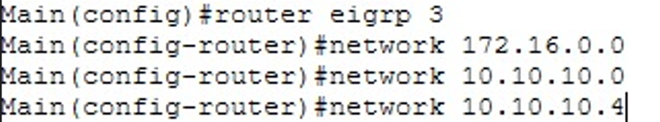
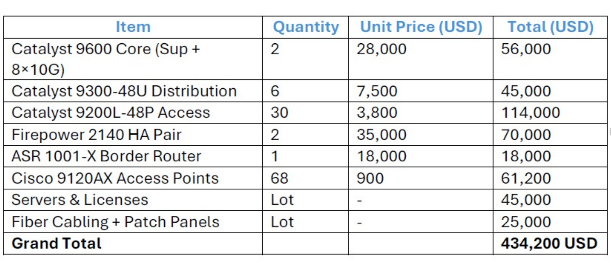

# Technical College Campus Network: Multi-Layer Enterprise Implementation

## Project Overview
This repository documents the design, configuration, and implementation of a secure, scalable multi-layer enterprise network for a technical college campus. We used a hierarchical architecture (core-distribution-access) with Cisco devices, focusing on VLAN segmentation, EIGRP routing, DHCP automation, and security via ACLs/SSH.  

### Key Features
- **VLANs for Segmentation:** Logical isolation for departments (e.g., Computer Science: VLANs 21-23; Engineering: 31-34).
- **Dynamic Routing:** EIGRP AS 100 for fast convergence and route summarization.
- **Inter-VLAN Routing:** Multi-layer switches with SVIs; fallback to Router-on-a-Stick.
- **DHCP & Security:** Automated IP pools with exclusions; Extended ACLs and SSH v2.
- **IP Plan:** Based on 172.16.0.0/20 supernet (see table below).

### Network Topology
  

### VLAN & IP Addressing Plan
| Subnet Name    | Network       | Subnet Mask   | Usable Range              | VLANs |
|----------------|---------------|---------------|---------------------------|-------|
| Access Labs   | 172.16.0.0   | 255.255.240.0| 172.16.0.1 - 172.16.15.254| 21   |
| Access-Faculty| 172.16.16.0  | 255.255.240.0| 172.16.16.1 - 172.16.31.254| 22  |
| Access-Al     | 172.16.32.0  | 255.255.240.0| 172.16.32.1 - 172.16.47.254| 23  |
| Labs-Al       | 172.16.48.0  | 255.255.240.0| 172.16.48.1 - 172.16.63.254| 31  |
| OFFICES       | 172.16.64.0  | 255.255.240.0| 172.16.64.1 - 172.16.79.254| 32  |
| Smart Rooms   | 172.16.80.0  | 255.255.240.0| 172.16.80.1 - 172.16.95.254| 33  |
| LAB Robotic   | 172.16.96.0  | 255.255.240.0| 172.16.96.1 - 172.16.111.254| 34|
| Admin         | 172.16.112.0 | 255.255.240.0| 172.16.112.1 - 172.16.127.254| 41|
| HR            | 172.16.128.0 | 255.255.240.0| 172.16.128.1 - 172.16.143.254| 42|
| Conf. Room    | 172.16.144.0 | 255.255.240.0| 172.16.144.1 - 172.16.159.254| 43|
| Public Works  | 172.16.160.0 | 255.255.240.0| 172.16.160.1 - 172.16.175.254| 51|
| IOT Works     | 172.16.176.0 | 255.255.240.0| 172.16.176.1 - 172.16.191.254| 52|

  

### Configurations
Explore device configs in `/configs/`:

  

### Cost-Benefit Analysis
  

### Setup & Testing
1. Use Cisco Packet Tracer or GNS3 to simulate.
2. Load configs into devices.
3. Verify: `show ip route`, `show vlan brief`, `show access-lists`.

For full presentation: [Download PDF](docs/Multi-Layer-Enterprise-Network-Implementation.pdf)

## Supervisor
Dr. Essam Abdellatef

## Authors
- [Basmala ElKady](https://github.com/Basmala-ElKady)
- [Sondous Adel](https://github.com/Sondous-Adel)
- [Rodina Bakr](https://github.com/rodinabakr)
- [Rawan Fares](https://github.com/Rawan-18)
- [Menna Osama](https://github.com/Menna-Osama01)
- [Ethar Ahmed](https://github.com/ethar21-hyp)
- [Arwa Mohey](https://github.com/ArwaMohey)

